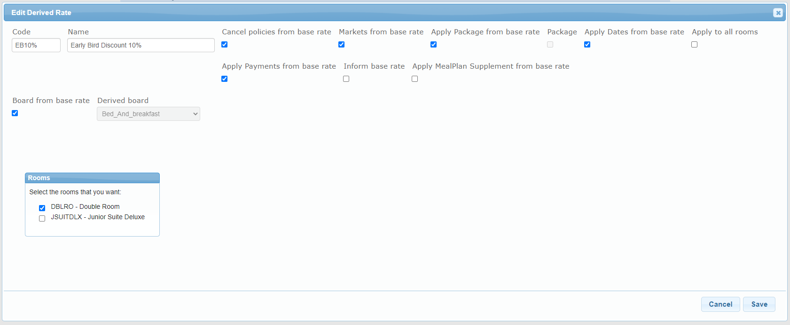

+++
title = "Discount/Supplement using derived rates"
pagetitle = "How to create a discount or supplement using derived rates?"
description = "Know how the create and configurate different discounts or supplements"
icon = "fa-file"
weight = 1
alwaysopen = false
isDirectory=false
+++

In order to create discounts or supplements as early bird offers, non refundable discounts or gala extra you can use what we call derived rates. These are rates that descend from non-derived rates and they may or may not modify some of the values of the base rate, such as cancellation policies or markets

We are going to explain the process to add a derived rate using an example of creating an Early Bird discount: 

## Step 1: Derived Rate SetUp

First, it is necessary to create the Derived Rate in the *SetUp* section. Once there, select the hotel and click the ``Add Derived Rate`` button for the same rate for which you want to create a derived rate:

 

A pop up window will appear for you to fill in the derived rate information:

 

* **Code:** Derived rate code. Must be unique per hotel. (it cannot coincide with any other rate or derived rate code in the same hotel).
* **Name:** Derived rate name.
* **Cancel policies from base rate:** Checkbox that will apply the cancel policies from the base rate to the derived rate depending on whether it is checked or not. If it is not checked, a form appears like the one seen previously when adding a rate, letting you add the cancel policies you may want for this derived rate.
* **Markets from base rate:** Checkbox that will apply the markets from the base rate to the derived rate depending on whether it is checked or not. If it is not checked, a form appears like the one seen previously when adding a rate, letting you select any markets you may want included or excluded for this derived rate.
* **Apply Package from base rate:** Checkbox that will apply the package conditions from the base rate depending on whether it is checked or not.
* **Package:** Checkbox that informs if the amount is for a package depending on if it is checked or not.
* **Active:** Checkbox to activate or deactivate the derived rate. If it is checked the derived rate is active.
* **Apply Dates from base rate:** Checkbox used to apply the effective dates from the base rate. If it is not checked appears a form like the one explained previously when creating a rate.
* **Board from base rate:** Checkbox used to apply the meal plan from the base rate. If it's not checked, the meal plan list will be enabled and you will be able to select the board of the derived rate.
* **Apply to all rooms:** Checkbox that will indicate whether the derived rate applies to all the rooms existing (or that will be added in the future) to the base rate. In case it is not selected, a list of rooms will appear, allowing you to select which rooms will be affected by the derived rate. It is mandatory to select at least one
room in order to be able to save the derived rate. Bear in mind that if the derived rate only applies to a set of rooms, when a new room is added to the base rate, it will not have the derived rate’s conditions applied to it. To apply the conditions of the derived rate to said room, you will have to edit the derived rate.
* **Apply Payments from Base Rate:** Checkbox that indicates if the *“Payment Type”* and *“Card Type"* are the same as the base rate. If so, it has to be selected. If not, you will be able to select this information from drop down menus, so that the derived rate can have its own payment types.
* **Inform Base Rate:** Checkbox that indicates that the retrieve functions would return the name of the Base Rate instead of the derived rate’s name, if checked.
* **Apply MealPlan Supplement from Base Rate:** Checkbox that allows the derived rate to have its own MealPlan Supplements. If checked, the derived rate would get the MealPlans of the base rate if any.

In our example we have created a derived rate specifying its code and name as a discount and we’ve indicated that we only want this discount to be applied to our *‘Double room’*. All other conditions will remain the same as its base rate. 

## Step 2: Derived Rate Price and Availability Load

Next step will be to add the discount or supplement and the availability conditions for your derived rate in the *‘Manual Load’* section:

 

Select your Derived Rated and load the date range that this discount/supplement will be applied and the sort of adjustment type (Type adjust amount) to apply with its
value (Adjust Amount). The adjust type is either percentage or amount.

The four possible combinations will be : 

**1.Percent supplement**
    * **Type adjust:** Percent
    * **Percent Adjust Amount:** Integer positive value.

This means that a supplement has been applied equal to the amount calculated, based on the percentage introduced, over the final price.

**2.Percent discount**
    * **Type adjust Amount:** Percent 
    * **Adjust Amount:** Integer negative value 

This means that a discount has been applied equal to the amount calculated, based on the percentage introduced, over the final amount. 

**3.Amount supplement**
    * **Type adjust Amount:** Amount
    * **Adjust Amount:** Integer positive value 

This means that a supplement has been applied equal to the amount introduced to the final amount. 

**3. Amount discount**
    * **Type adjust Amount:** Amount
    * **Adjust Amount:** Integer negative value 

This means that a discount has been applied equal to the amount introduced to the final amount. 

{} If you want the derived rate to have a discount or offer applied to it, you will have to introduce a negative value. To do so you must introduce a minus before the value. {}

In this example, we have loaded availability and conditions for our ‘Early Bird Discount 10%’. The discount will be available all February, applying a 10% discount and only if the release is 60 days before the check in day. 

Once you have created your discount/supplement you will be able to check this information in the *Calendar* section as follows:

 

{}