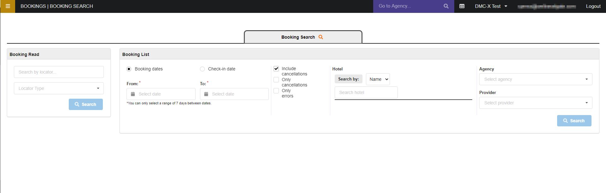
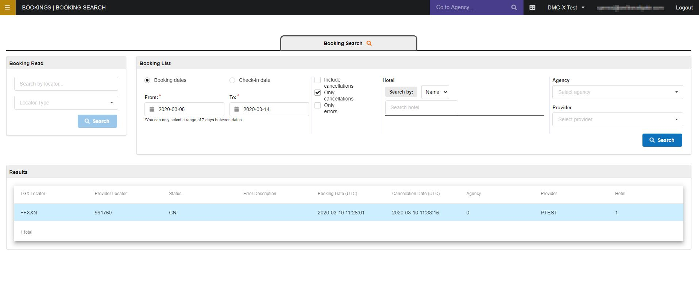

+++
title = "Booking Search"
pagetitle = "Booking Search"
description = "Panel that allows you to check your reservations and its details"
icon = "fa-search"
weight = 4
alwaysopen = false
isDirectory=false
+++

The booking search tool allows you to obtain a list of all your agencies bookings and cancellations and get more detail information about it. To obtain a list with base informacion you can use the `Booking List` panel, and then, to check a specific booking and obtain all its details you can use the `Booking Read` panel.

 

 

## Booking List

Booking list allows you to filter by different conditions:

* Dates:
    * Booking dates: The date range when the booking was confirmed by the agency.
    * Check-in date: The date range when the booking check-in is included. 
* Transaction type/status:
    * Include cancellations: List with both effective bookings and cancelled ones. 
    * Only cancellations: List with only cancelled bookings.
    * Only errors: List with bookings that failed and couldn't be confirmed successfully.
* Hotel:
    * Name: Filter bookings by hotel name.
    * Code: Filter bookings by hotel code.
* Agency: Filter bookings by agency/client.
* Provider: In case you work with different suppliers, you can filter by provider name.

 

 

## Booking Search

In order to obtain more details and information of a specific booking you can use the `Booking search` panel with one of the locators provided (Client, Provider or TGX).

For each booking you will find the following information:

* Locators: All booking locators.
* Context: 
    * Status: Booking status (success, cancelled, error)
    * Booking date
    * Agency 
    * Supplier
    * Access
* Configuration
    * * Hotel: Hotel code and name
    * * Check-in date
    * Check-out date
    * Mealplan
    * Market
    * Nationality
* Price & Conditions
    * Payment type
    * Cancellation price
    * Selling price
    * Purchasing price
    * Currency exchange
    * Quote selling price
    * Quote purchasing price
    * Quote currency exchange
    * Quote selling cancel penalties
    * Quote purchasing cancel penalties
* Pricing
    * Type
    * Final Markup
    * Tax
* Breakdown
    * Base Markup
    * Base Rappel
    * Selling pricing rules: Total
* Rooms
    * Main Guest Name
    * Room: Room name, code, and number of pax

{}