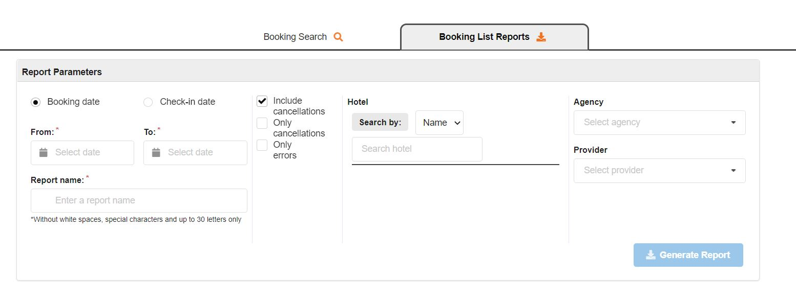
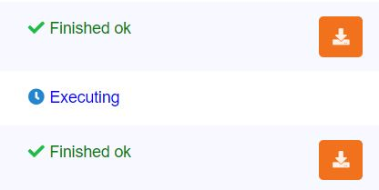
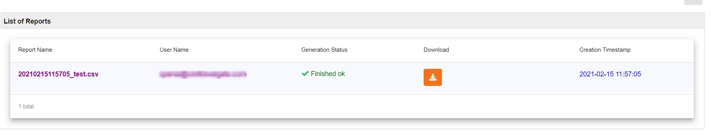

+++
title = "Booking Panel"
pagetitle = "Booking Panel"
description = "Panel that allows you to check your reservations and their details"
icon = "fa-search"
weight = 4
alwaysopen = false
isDirectory=false
+++

The booking panel tool allows you to obtain a list of all your agencies bookings and cancellations and get more detailed information about it. To obtain a list with base information you can use the `Booking List` panel. To check a specific booking and obtain all its details you can use the `Booking Read` panel. 
 

 

You can also download a .csv file with a detailed report of your bookings from our section `Booking List Reports` (this functionality is especially used by our DMC clients).

 

 

## Booking List

Booking list allows you to filter by different conditions:

* Dates:
    * Booking dates: The date range when the booking was confirmed by the agency.
    * Check-in date: The date range of the booking check-in. 
* Transaction type/status:
    * Include cancellations: List of both effective and cancelled bookings. 
    * Only cancellations: List of only cancelled bookings.
    * Only errors: List of bookings that failed and couldn't be confirmed successfully.
* Hotel:
    * Name: Filter bookings by hotel name.
    * Code: Filter bookings by hotel code.
* Agency: Filter bookings by agency/client.
* Provider: In case you work with different suppliers, you can filter by provider name.

 

 

## Booking Read

In order to obtain more detailed information of a specific booking you can use the `Booking read` panel on the left and filter by one of the booking locators (Client, Provider or TGX).

For each booking you will find the following information:

* Locators: All booking locators.
* Context: 
    * Status: Booking status (success, cancelled, error)
    * Booking date
    * Agency 
    * Supplier
    * Access
* Configuration
    * Hotel: Hotel code and name
    * Check-in date
    * Check-out date
    * Mealplan
    * Market
    * Nationality
* Price & Conditions
    * Payment type
    * Cancellation price
    * Selling price
    * Purchasing price
    * Currency exchange
    * Quote selling price
    * Quote purchasing price
    * Quote currency exchange
    * Quote selling cancel penalties
    * Quote purchasing cancel penalties
* Pricing
    * Type
    * Final Markup
    * Tax
* Breakdown
    * Base Markup
    * Base Rappel
    * Selling pricing rules: Total
* Rooms
    * Main Guest Name
    * Room: Room name, code, and number of pax
   
   
  
## Booking List Reports

The booking reports tool allows you to obtain a file with all the bookings that have been done inside the report parameters specified. The search parameters will be the same as can be seen in the Booking Read.

Note that even though you should add a valid name to the report (alphanumeric format) our system will also add a datetime format at the beginning of this name in order to ensure it is unique.

The display of the reports created can be shown in the List of Reports. There are two importants thing to know:

   * Only one report can be generated every 15 minutes. So, once a generation is asked, the user should wait 15 minutes to ask for a new one.
    
   * The generation of the report is not instant and it might take some time, depending on the volume of bookings to return. If Generation Status is equal to “Executing” the file is not processed yet, so it is still not available.

      
  

   * When the status changes to "Finished ok", the download button will be available.
      
 
 

{}
