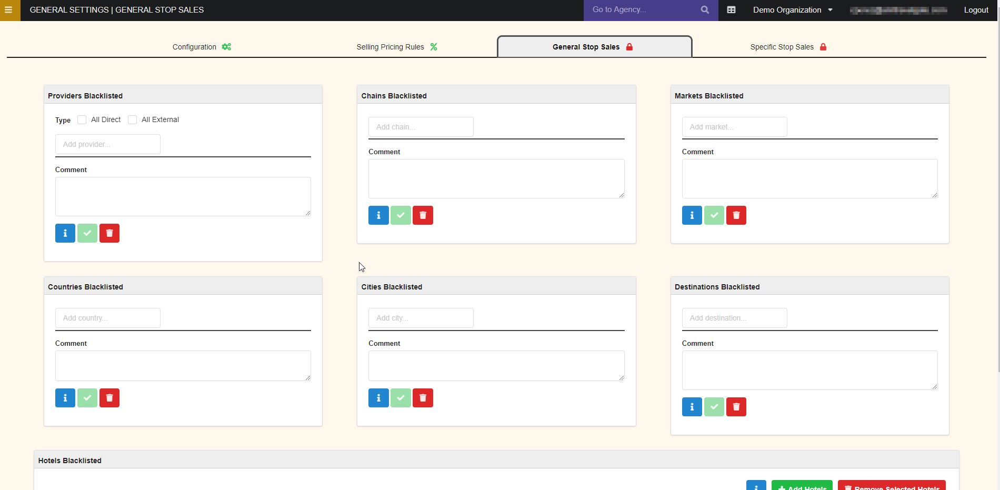
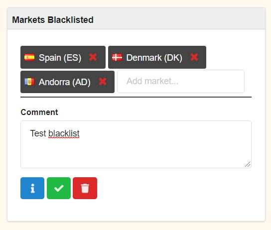

+++
title = "General stop sales"
pagetitle = "General stop sales"
description = "Define general stop sales by different conditions"
icon="fa-ban"
weight = 3
alwaysopen = false
isDirectory = false
+++

## Overview

Blacklists are filters that allow us to exclude products from sale. This filter can be applied to hotels directly, or to some property contained by several hotels. This page allows us to apply, modify or eliminate Blacklists quickly and easily on the different categories:

* Providers
* Hotel chains
* Markets
* Countries
* Cities
* Destinations
* Hotels

## Create and configurate a new rule

To create a general stop sale you will only need to add the values to filter in each stop sale condition box and write a comment. For example, to blacklist some markets you will add the market name in the *Markets Blacklisted* with a comment:

{}Don't forget to click on the green button to save your rule.{}

For each box, and as is shown in the previous image, you will find three different buttons:

* **Information:** Check last update and stop sale comments.
* **Save:** Save your changes.
* **Delete the rule.**

{}