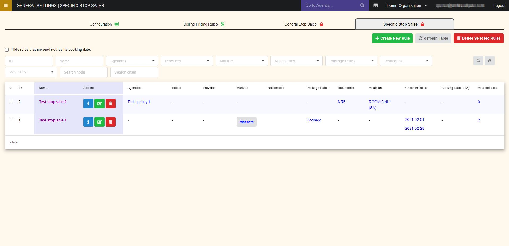
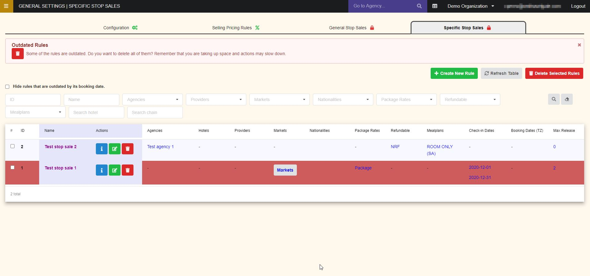

+++
title = "Specific stop sales"
pagetitle = "Specific stop sales"
description = "Define specific stop sales by different conditions"
icon="fa-ban"
weight = 4
alwaysopen = false
isDirectory = false
+++

## Overview

The *Specific Stop Sales* specify a series of condition for the product to be exclude of sale. These stops sales work as the general stop sales but with more conditions and configurations. 

In the table you will see the conditions on which each stop sale applies, such as: Agencies, Hotels, Markets, Refundable, Check-in Dates ….

In the first and second column is shown the code and name rule. The third column contains the pricing applied and in the *Actions* column some buttons where you will be able to:

* **Information:** Check last update and stop sales comments.
* **Edit the stop sale.**
* **Delete the stop sale.**

 

{}If in one of the columns you have a button, it means that you have configurated a list of values, and the condition will be fulfilled if it has at least one of those values. To see the values that are applied, you can click the button and a modal will be displayed showing them.{}

 

 

## Create and configurate a new rule

To create a specific selling pricing rule in this section, we have to use the `Create New Rule` button and a modal similar to the following image will be displayed:

 

In the *Basic* tab you should add basic information about the stop sales as the name to identify it and rate conditions as *package*, *refundable* or its *price type*. You can also select from this tab if the stop sale should be applied to all agencies and providers or indicate an specific list of each group. A comment is mandatory to create the stop sale.

In the *Advanced* tab you can choose some additional settings that the system will consider to apply the stop sale, such as a specific list of mealplans, markets, check-in dates or booking dates.

In the *Hotels* tab, you can select a list of hotels, hotel country or city, chains and destinations to decide to which this rule applies.

## Outdated Rules

There are some stop sales that can only be applied to certain dates, for example, if you have created a specific stop sale applying to check-in dates in December. These stop sales must be gradually eliminated so that inactive rules do not accumulate and in order to streamline operations.

When you have expired stop sales, its rows will be displayed in red and the following message will be displayed in the extranet:

 

If you select the trash button, all the stop sales rules whose date has already passed will be eliminated.

{}