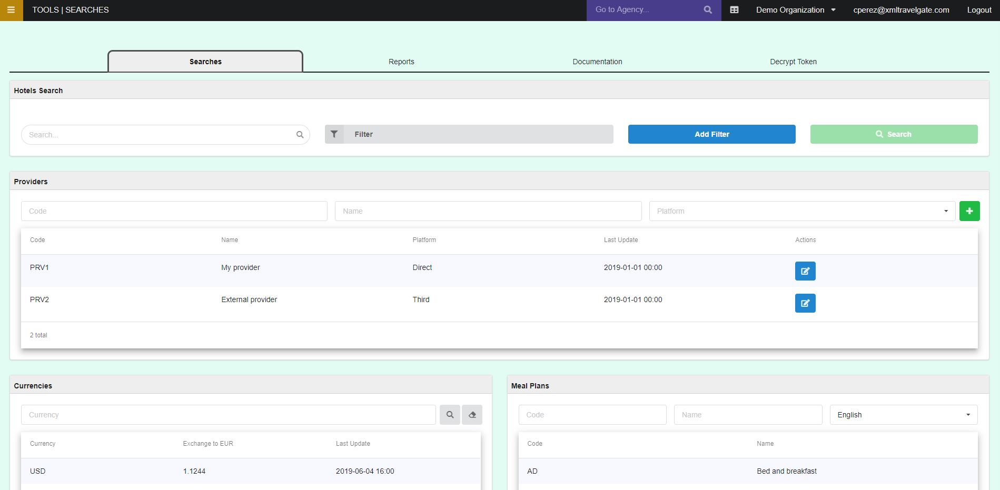
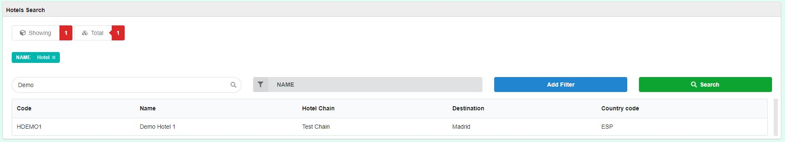
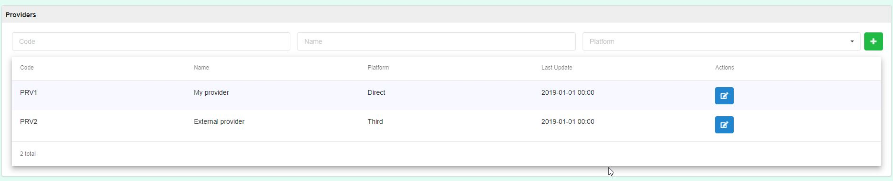
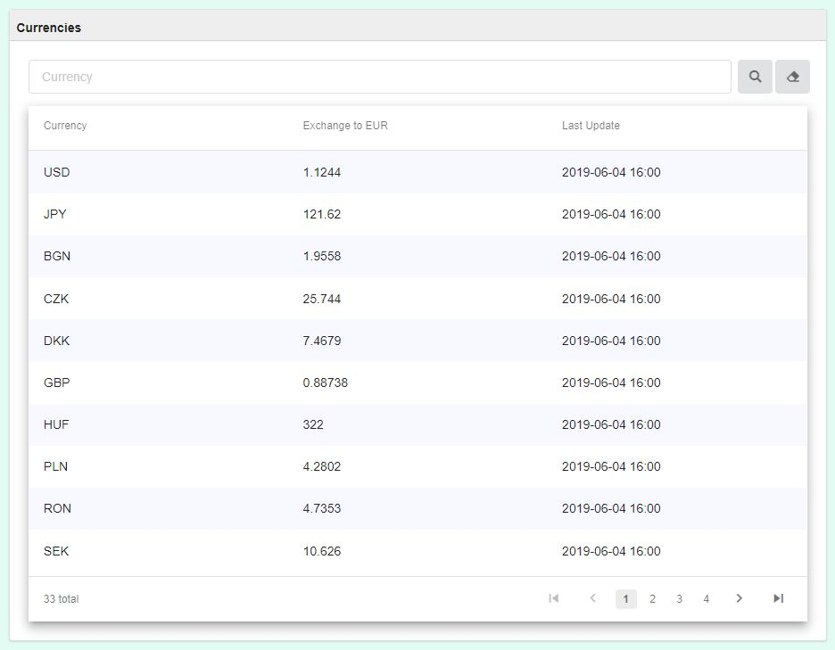
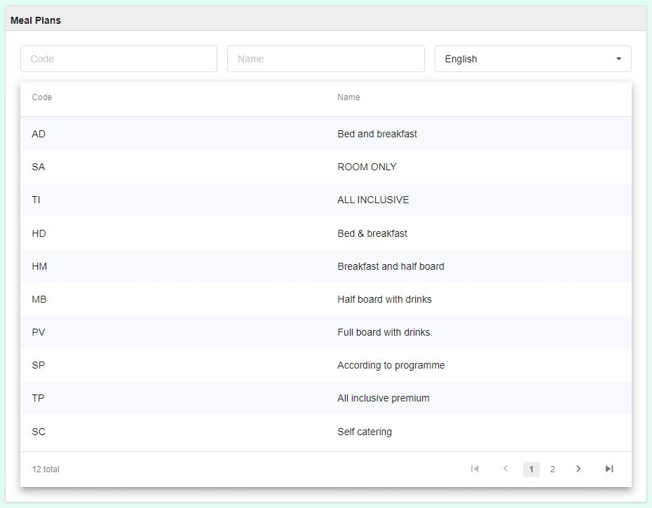

+++
title = "Searches"
pagetitle = "Searches"
description = "Search among your hotels, providers, currencies and meal plans"
icon = "fa-search"
weight = 1
alwaysopen = false
isDirectory=false
+++

## Overview

This tool allows us to perform a search on our hotels and suppliers to see their static data.

### Hotels

From the component, by selecting filter, it lets us choose between one of the possible search fields: 

* Hotel Name
* Hotel Code
* Hotel Chain
* Destination 
* Country Code.

An example searching by hotel name: We choose the filter and its value, we add it and we can carry out the search. It is possible to specify as many filters as we want. The result would be the following:

### Providers

In this case the list of providers is filled in automatically, and we can search on it, for example by default it would look like this:

You will be able to add providers using the extranet or a [master file](https://docs.travelgatex.com/distribution/file-loads/masters/providers/). To add a provider you can click on the `+` button. You need to indicate the following information:

* **Code:** The provider code in TravelgateX platform.
* **Name:** The provider name you want to have for this supplier in the extranet.
* **Direct:** You can specify if the supplier is direct or a third supplier. This will be useful when you add rules in Distribution and you want to filter by provider, because you will be able to indicate a specific provider or all providers that are "Third" or "Direct".

### Currencies

You can check the current currencies list used by Distribution-X and its exchange:

### Meal Plans

You can check the mealplan list with the code and name information:

{}
