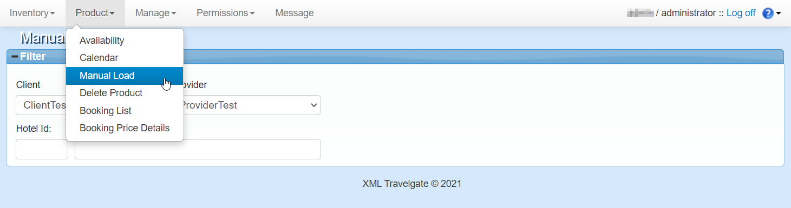

+++
title = "Manual Load"
pagetitle = "Manual Load"
description = "Load avaialbility, prices and conditions"
icon = "fa-upload"
weight = 2
alwaysopen = false
isDirectory=false
+++

The aim of the *Manual Load* section is to control the conditions of the rates and derived rates. It is the main tool to load allotment, conditions and prices, as well as offers and supplements in the base and derived rates. You will be able to access this section in the *Product* tab. 

{}