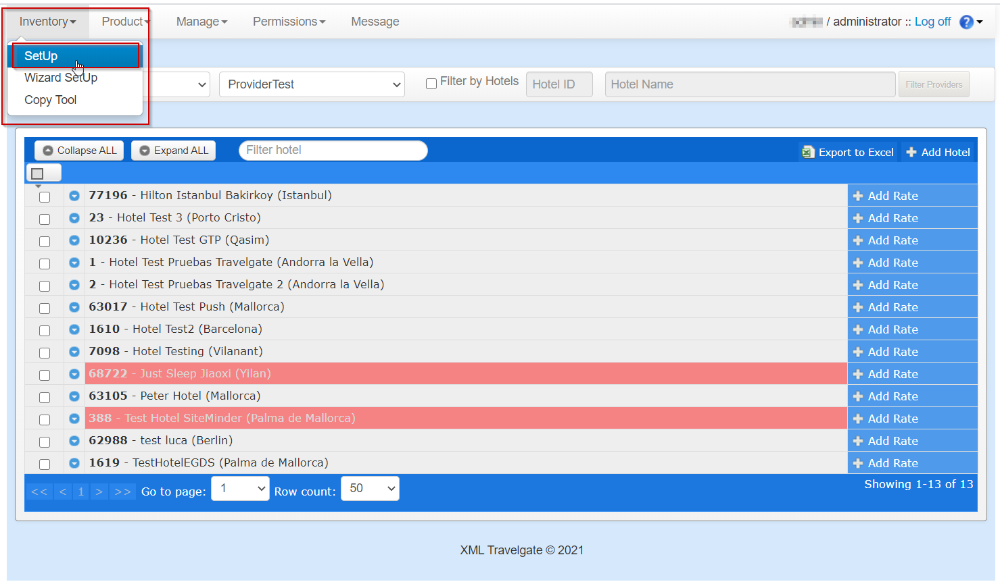
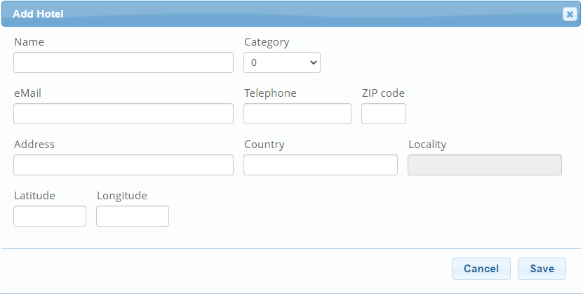
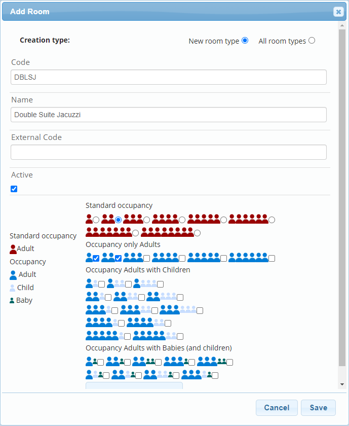
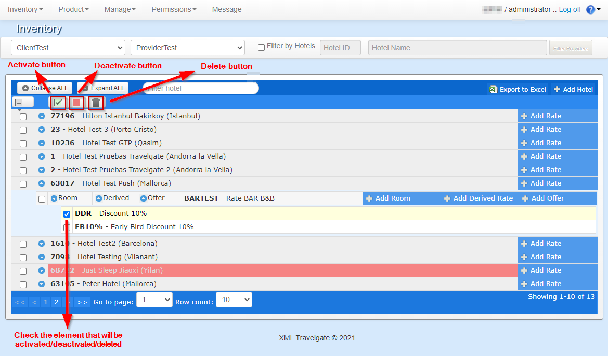
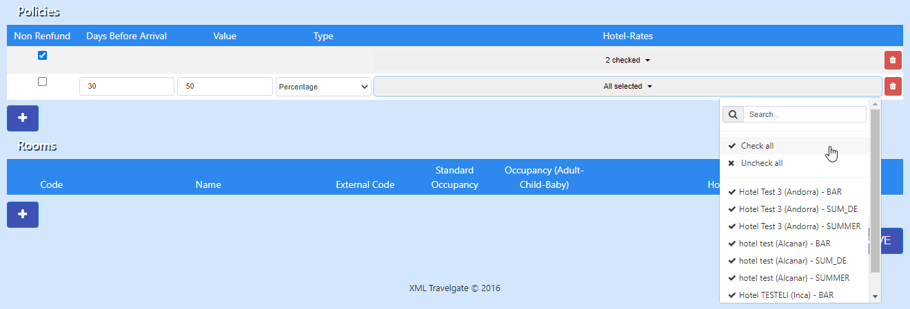

+++
title = "SetUp"
pagetitle = "Setup"
description = "Configure the SetUp and structure of your inventory"
icon = "fa-hotel"
weight = 1
alwaysopen = false
isDirectory=false
+++

# SetUp

The SetUp section enables you to configure the hotels you are going to buy from your connected channel managers or to create the main structure of your own product is you are going to use the extranet to load your static contracts. 

 

The configuration of the main structure used in Inventory is as follows: 

1. [Hotel](#hotel)
2. [Rate](#rate)
3. [Room](#room)

There are a series of hotels available that can have one or more rates. Each rate can also have one or more rooms.

Optionally, you will be able to configurate different discounts, supplements or night offers with the following:

* [Derived Rate (Discounts/Supplements)](#derived-rates)
* [Free night offers](#free-night-offers)

All these structures can be activated/deactivated or deleted. See [Activate/Deactivate/Delete](#activate/deactivate/delete) section for more details.

In this page you can also find information about the [Wizard SetUp](#wizard-setup), created to help configure multiple hotels that share the same rates and rooms information.

## Hotel

### How to view hotels already setup

There are two ways of checking hotels already configured: you can view all the hotels for a relation ``Client – Supplier``, as in the previous image. Alternatively, you can search  suppliers or channel managers that have a specific hotel. To filter is faster if you want to search for a particular hotel - tick the checkbox of ``filter by hotels``, type either the hotel code or name and complete it with one of the options that the autocomplete offers (the field left as blank would be filled automatically).

 

Click the button ``Filter Providers`` and a list of providers that offer the selected hotel will appear in the drop-down menu. Once you select one of those channels, only the configuration done for this hotel with this supplier will appear.

### How to add a hotel

To add a new hotel in your configuration you should click the `Add Hotel` button. A pop-up window will appear with information to fill in relation to the hotel you are about to add:

 

* **Hotel name:** This autocomplete field makes suggestions while you are typing the hotel’s name. Inventory's system works with a master hotel database where we store all the basic information of the hotels setup by our Partners . If the hotel you require is not available in the autocomplete field you can create it yourself by clicking  the `Create Hotel` button. *See [How to create a new hotel](#how-to-create-a-new-hotel) section to learn the basics on how to create a hotel.* Notice that if the hotel you want to add has already been added to this client-channel relation, it will not appear as a suggestion in the autocomplete field.

* **Hotel Email:** Hotel email configurated in Inventory's system. This is the email address that will be used to notify the hotel when a booking or cancellation is made. If you don't want our system to send this notification to the hotel, you can uncheck the checkbox `Notify Booking`.

* **CC Address:** CC email address to which a notification is sent when a booking or cancellation is made. If the checkbox `Use Client Email` is checked, by default, the client email is added. If you want to change the cc email address, you have to uncheck the checkbox and then modify the email address.

* **From Address:** The notification email is always sent from a *no-reply* email address. Note that at the bottom of the email there is a message warning the reader that for any questions or queries, they should contact a specific email address. If the box is checked, the Buyer's email is added there by default. If you want to configure the email that will be indicated at the bottom of the notification email, uncheck the checkbox.

Once added, the hotel will appear in a row in the SetUp menu, where you will be able to see its name and ID. You will be able to see this in a list among other hotels you have configured.

The following image is an example of an email notification and the information it contains such as the locators, client, room, price, etc. This email is only **informative**. 

 

{}For DMC-X clients, price will not be included in the Inventory-X email notification.{}

### How to create a new hotel

If you cannotfind the hotel you want to add in the autocomplete field you'll be given the option to create this hotel in our DataBase by clicking the button ``Create Hotel``. You will need to indicate the **hotel's** basic information in the following form: 

 

{}Please complete the form using the hotel's actual information. It's mandatory that the email and telephone are those of the hotel and not from the supplier. Coordinates should be as accurate as possible.{}

 

{} This feature is available for client and provider administrator users. {}

 

## Rate

Now that you have added the hotel it is time to add the rates and then the rooms.

### How to add a rate

In order to add a new rate, click in the ``Add Rate`` button in the hotel row:

 

The information needed to add a rate is listed below:

* **Code:** Rate code. It needs to be unique per hotel. This code need to coincide with the rate code of the channel manager.
* **Name:** Rate name.
* **Included board:** Meal plan.
* **Age Max Baby:** The maximum age for a passenger to be considered a baby (indicated age not included, meaning if the *Max Age* for a baby is 3 you should indicate 4, that way any passenger aged 0-3 will be considered a baby).
* **Free Baby:** Check to indicate that babies are free of charge if you are working with Channel Managers that can't load this kind of free baby condition. Use only if the Channel Manager works with *Standard Occupancy* price. See [How to load free charges for child/baby pax](./../../../FAQ/free-children-baby) section for more details. 
* **Age Max Child** The maximum age for a passenger to be considered a child (indicated age not included, same as the maximum age for a baby).
* **Free Child:** Check to indicate that children are free of charge if you are working with Channel Managers that can't load this kind of free child condition. Use only if the Channel Manager works with *Standard Occupancy* price.
* **Currency:** Currency applied to the rate.
* **Commission:** Percentage of commission applied. This is only informative.
* **Binding Price:** Must be checked if the price is binding.
* **Package:** Must be checked if the rate allows packages.
* **Senior Rates:** You must select the correct value if the rate is for people over 55, 60 or 65 years of age. The default value is *Not selected*.
* **Active:** Indicates whether or not the rate is active.
* **All dates:** By default it is checked. If it is checked, the rate will be available always. If you uncheck the checkbox, two new fields will appear: From and To. These fields are the initial and final dates for when the rate is available (dates when the availability request is done, not the stay dates). For example: if there is a date range from: `24/02/2020` to: `28/02/2020`:
    * If an availability request is made between February 24 and February 28 (both days included) and if there is price and allotment loaded for this rate, there will be availability returned correctly in the search response.
    * If the availability request is made before February 24 or after February 29 there will be no availability because the request would not have been made in the indicated range.
* **Markets:** This is a market filter. Clicking the ``+`` button on both Include or Exclude, allows you to add the country code of the market that you want to include or exclude. For example, if a rate includes the market "ES" and an availability search is made for the market "IT", there will not be availability returned, because "IT" is not an included market. On the other hand, if one market is excluded, for example "ES", there will be availability returned for all other markets except the Spanish. In case no market is indicated in these fields, no market filter will be applied.
* **Payment Type:** Indicate the payment type to work with. If you don't have this field in your panel it means that the supplier or Channel Manager your are working with doesn´t allow credit payment and by default *"MerchantPayment"* is selected.
    * **MerchantPayment:** The customer pays the client and the client will pay the provider.
    * **DirectPayment:** The customer will have to use a credit card as a guarantee for the hotel and the payment will be done by the customer at check-in.
    * **BookingDatePayment:** The client will use a credit card with the exact amount of the booking so they can pay the provider/hotel. The provider will charge the payment on the day of the reservation.
    * **ArrivalDatePayment:** The client will use a credit card with the exact amount of the booking so they can pay the provider/hotel. The provider will charge the payment on the day of the check-in.
* **Card Type:** List with different card types. Select the cards allowed between the client and the provider.
* **Taxes:** Taxes that can be added to the rate. By default, there are no taxes in a rate, but they could be freely
added once the checkbox of "Taxes" is checked: 
    * **Type:** the type that would take the value of the tax, it can be a % or an amount.
    * **Value:** the value of the tax.
    * **Description:** the description that can be indicated for a tax: "City", "Local", "Resort fee" and "Supplement to be paid on spot".
    * **Per Night:** if checked, the tax will be applied for every night.
    * **Per Pax:** if checked, the tax will be applied for every pax.
    * **Add to final price:** if checked, the tax price will be included in the final price that the client will pay. If it is not checked, the tax will be informative to the final customer and should be paid for them at the hotel.
* **Cancellation policy – Base:** Cancellation policies that can be applied to the rate. The rate will be non refundable if the checkbox ``No refund`` is checked. It is possible to apply a different type of cancellation policy by clicking the `+` button. You can add as many policies as you need, all you need to do is indicate the days in advance before the arrival date, the type and the value of the policy. See [How to configurate different cancel policies](./../../faq/cancel-policies) section for some examples.
* **Cancellation policy - Calendar:** This option will only appear once you have created your rate previously with base cancel policies. The cancellation policy by calendar allows you to create specific cancel policies by day or date range. You can click the `Add range` button to specify a date range and the cancel policies. This new cancel policies by day will override the base cancel policies specified at rate level. If you want to remove a cancel policy by date you can click the `Delete range` button and specify your dates. You can also delete or check the cancel policies by day clicking in the day's number of the month.

When a rate is added, it appears in the hotel node when you click the arrow that appears on the left side of the hotel name.

 

## Room

The next step is to add and configurate rooms to each rate. 

### How to add a room

In order to add a new room, click in the ``Add Room`` button in the hotel row and a pop-up window appears where you will find two options:

1. **All room types:** Select from the autocomplete field a room code and description from your own room master list. Room code can be modified for this rate.

 

2. **New room type:** Create a new room type, enter a code and a description for your own reference. Once saved, this room type will be added to the room master list and will appear as an option in ``All room types``.

 

* **Code:** Room code. Must be unique per rate and has to coincide with the code used by the channel.
* **Name:** Room name. Text field that allows you to introduce the room description that will be shown to your buyers. This field is just informative.
* **Standard Occupancy:** This field is useful to calculate the room amount when prices are loaded per passenger. Normally, it indicates the maximum number of adults (only adults) allowed for the room. 
* **Occupancy only Adults:** Defines the occupancies of adults allowed for this room. (Dark Blue icons are adults).
* **Occupancy Adults with Children:** Defines occupancies of adults and children allowed for this room. (Light Blue icons are children).
* **Occupancy Adults with Babies (and children):** Defines the occupancies of adults, children and babies allowed for this room. (Green icons are babies).

 

## Derived Rates

In Inventory you can create your own discounts or supplements using what we call *Derived Rates*. These are rates that descend from non-derived rates and they may or may not modify some of the values of the base rate, such as cancellation policies or markets. The main use of the derived rates is to permit the loading of supplements or discounts for specific rooms from its base rate.

To add a derived rate, first it is necessary to click the ``Add Derived Rate`` button for the same rate for which you want to create a derived rate and a pop-up window will appear for you to fill in the derived rate information.

 

The information needed to add a derived rate is listed below:

* **Code:** Derived rate code. Must be unique per hotel. (it cannot coincide with any other rate or derived rate code in the same hotel).
* **Name:** Derived rate name.
* **Cancel policies from base rate:** Checkbox that will apply the cancel policies from the base rate to the derived rate depending on whether it is checked or not. If it is not checked, a form appears like the one seen previously when adding a rate, letting you add the cancel policies you may want for this derived rate.
* **Markets from base rate:** Checkbox that will apply the markets from the base rate to the derived rate depending on whether it is checked or not. If unchecked, a form appears like the one seen previously when adding a rate, letting you select any markets you may want included or excluded for this derived rate.
* **Apply Package from base rate:** Checkbox that will apply the package conditions from the base rate depending on whether it is checked or not.
* **Package:** Checkbox that informs if the amount is for a package depending on if it is checked or not.
* **Active:** Checkbox to activate or deactivate the derived rate. If it is checked the derived rate is active.
* **Apply Dates from base rate:** Checkbox used to apply the effective dates from the base rate. If unchecked, a form like the one explained previously when creating a rate will pop up.
* **Board from base rate:** Checkbox used to apply the meal plan from the base rate. If unchecked, the meal plan list will be enabled and you will be able to select the board of the derived rate.
* **Apply to all rooms:** Checkbox that will indicate whether the derived rate applies to all the rooms existing (or that will be added in the future) to the base rate. In case it is not selected, a list of rooms will appear, allowing you to select which rooms will be affected by the derived rate. It is mandatory to select at least one
room in order to be able to save the derived rate. Bear in mind that if the derived rate only applies to a set of rooms, when a new room is added to the base rate, it will not have the derived rate’s conditions applied to it. To apply the conditions of the derived rate to said room, you have to edit the derived rate.
* **Apply Payments from Base Rate:** Checkbox that indicates if the *“Payment Type”* and *“Card Type"* are the same as the base rate. If so, it has to be selected. If not, you need to select this information from drop down menus, so that the derived rate can have its own payment types.
* **Inform Base Rate:** Checkbox that indicates that the retrieve functions would return the name of the Base Rate instead of the derived rate’s name, if checked.
* **Apply MealPlan Supplement from Base Rate:** Checkbox that allows the derived rate to have its own MealPlan Supplements. If checked, the derived rate would get the MealPlans of the base rate if any.

{} See [How to create discounts and supplements](./../../faq/discount-supplement) section for a complete example. {}

 

## Free Night Offers

The Inventory extranet allows you to add free night offers to the rates and its rooms, indicating that in case the end customer stays a specific number of nights, they will get another number of nights for free. 

Firs step would be to click in the ``Add Offer`` button over the base rate for which you want to add the offer. A pop-up window appears for you to complete the following information.

 

* **Code:** Offer code. It must be unique at rate level (it can not match with any other offer code in the same rate).
* **Name:** Offer name.
* **Offer Type:** Type of offer to apply. Currently the only available type is free night.
* **Length Of Stay:** Minimum and maximum length of stay that the booking has to comply with.
* **Applicable Days of Week:** Days of the week that the offer will apply to.
* **Available Dates:** Used to specify whether the offer is available for all the dates or just for a particular date range.
* **Apply to all rooms:** Used to specify whether the offer will apply to all the rooms of the rate or just to some of them.

 

## Activate/Deactivate/Delete

If a hotel, rate or room is deleted, it is erased in the system, and it's not possible to retrieve it. The information is not recoverable, so if you deleted it by mistake, you will have to set it up it again and reload prices, allotment(number of rooms available), etc.

If you deactivate a hotel, rate or room it will remain in the system but it will not be visible when doing an availability search request. To have the hotel, rate or room available again you will have to re-activate it.

In the following image you will see the three action buttons to activate, deactivate or delete a element.

 

In case there are any hotels, rates, derived rates or rooms deactivated, they will appear on a red background, as you can see in the previous image for hotel *"Just Sleep Jiaoxi"* 

 

# Wizard SetUp

The Wizard Setup is a tool that is be really helpful when you have to create lots of the same rates and rooms for different hotels. 

 

You will be able to create hotels rates, rooms and cancellation policies and then create the relation among them. Once you have selected the client-channel relation, a Wizard SetUp view with four different sections will appear:

 

The process is quite simple. In order to add a new hotel you will have to click the ``+`` button, situated at the bottom of the Hotels section. A row with a few fields that have to be completed will appear.

Like in the SetUp tab, the field ``Name`` will be used for the names of hotels as you are introducing data. When you have found the hotel you want to add, it is necessary to click it. The fields ``Hotel Email``, ``CC Address`` and ``From Address`` might be changed if you want, however, it's not possible to leave any of them empty. You can add as many hotels as you want.

Once there are hotels added you can set up rates. To do so, click the ``+`` button located at the bottom of the Rates section. A row will appear and you will need to complete the information regarding the rate. This information is the same that the one explained in the section [How to add a rate](#how-to-add-a-rate), except for the fields ``Active`` and ``All Dates``. All rates will be active and available always. If you want to change this fields, you will need to change it in the SetUp
tab.

 

Once the rate information is filled in, you can indicate which hotels this rate will apply to, as you can see in the previous screenshot.

Once rates have been added you can keep on creating the cancellation policies. Click the blue button `+` located at the bottom of the Policies section. A new row will show up with a few fields regarding the cancellation policies that you would have to fill in. The functionality of the drop down multi selector will allow you to assign these cancellation policies to a specific Hotel – Rate pair that you want.

 

Next step is to add the rooms that will be available for the different rates of each hotel. To do so, as mentioned before, you have to click the blue ``+`` button located at the bottom of the Rooms section and then you will be asked to fill in the room information. You should introduce the hotel name into the field *Name* and it will show you suggestions as you are introducing the name. Afterwards it will be necessary for you to introduce the standard occupancy, select the different occupancies allowed by the room (this will be indicated as follows: number of adult – number of children – number of babies) and the pairs Hotel – Rate that will have this room assigned to them.

 

When this process of the creation is over, in order to save the configurations, you have to click the ``Save`` button. In case that there is an error, a message will appear at over the view indicating what has happened and keeping the data filled in. If there is no error and everything has worked correctly a pop-up window will appear, informing that everything is correct.

{}
