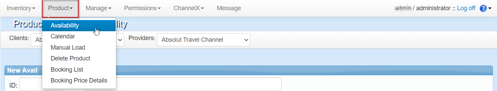

+++
title = "Availability simulator"
pagetitle = "Availability simulator"
description = ""
icon = "fa-search"
weight = 1
alwaysopen = false
isDirectory=false
+++

In order to simulate the availability requests and response for the product loaded in Inventory-X you will need to go to the ``Product`` tab and then select the ``Availability`` option in the Inventory-X extranet.

 

First step will be to indicate the desired Client-Provider connection and then the hotel to search availability. After that, you should specify the following conditions:

* **Hotel**: Hotel name or ID to request for.
* **Dates:** Check-in and check-out date to request for.
* **Packages Rates**: Check if you also want to receive package rates.
* **Markets**: Optional filter if you only want to receive rates allowed for specific markets.
* **Rooms**: Number of rooms to request for.
* **Paxes and ages**: Number of pax in each room and their age.

Once you have filled all the information you can click on the `Search` button and all options and prices will appear if there is any rate that fullfills all conditions.

{} Please, bear in mind that this is just a visual tool that will show you the different options available based on the request that
you make. It will not let you to do neither a Valuation nor a Booking request,because this is not the purpose of this tool. {}

{}
