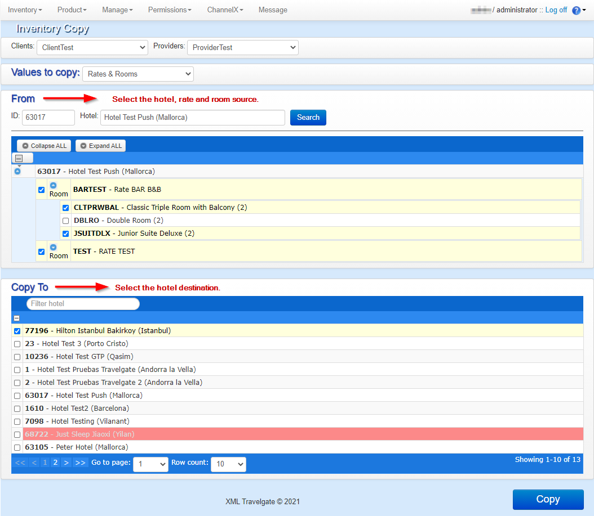

+++
title = "Copy Tool"
pagetitle = "Copy Tool"
description = "Copy configurations to make the SetUp process easier and faster"
icon = "fa-copy"
weight = 1
alwaysopen = false
isDirectory=false
+++

If you to do a lot of configurations in the SetUp process, this might become boring, so in order to make the SetUp easier and faster you will be able to user the `Copy Tool` in the ``Inventory`` tab of the extranet.

 

First step will be to indicate the desired Client-Provider connection. You will see on the `Values to copy` field that it is possible to choose among different actions to carry:

## Set Up

This option will copy the complete SetUp from one or more hotels to a different provider connection. This can be useful if you have the same hotel configurated in different Channel Managers and you want to use the same configurarion (Rates and rooms).

To copy the SetUp you will only need to indicate the provider to add the new hotels in the `Target Provider` field. Then, you will be able to mark with the check fields the hotels you want to copy and click on the `Copy` button.

 

## Rate in same hotel

This option is used to copy rates within the same hotel. You'll need to indicate the hotel ID or name and check the rate to be copied. Once selected the rate you should click on the `Copy` button and  you will be asked to introduce a new rate code (remember that this code must be unique per hotel), a new name and a new meal plan.

Once the new values are set, click the ``SEND`` button to save the changes or the ``CANCEL`` button if you want to reject them.

 

## Rate Information

This option allows you to copy rate information from one hotel to a different one or within the same hotel as the original. As an example, this tool can be used in case you want to substitute the cancellation policies of a rate with those of a preexisting rate.

First you need to indicate the hotel ID or name and the source rate. After that, all its information fields will shown so you will be able to select which information you want to copy. By last, select the hotel and rate destination and click on the `Copy` button.

 

## Price & Allotments

This option allows you to copy the prices or the allotment that have been loaded for a certain room to other rooms in other hotels. Those two options will also include the copy of the supplements, conditions or restrictions that may be
loaded.

You can copy a specific range of dates or all the dates for which the product has been loaded. By default, the information will be copied for all dates, unless a date range is specified. You can also copy both allotment and prices at the same time or just one of the two. This method allows you to copy multiple destination rooms from multiple rates and multiple hotels.

 

{} In case of copying prices, it is important to check that the destination rooms are configured with the same occupancies as the selected room. This tool does not take responsibility for differences in occupancy prices that could appear if this rule is not followed. {}

## Derived Rates

This option allows you to copy derived rates from a source hotel to a destination hotel. Notice that the source hotel can be the same as the destination hotel. In addition, it is also possible to copy more than one derived rate from more than one source base rate to several destination rates in different destination hotels.

 

When you click the ``Copy`` button, a pop up window will appear where you will be able to select the rooms that you want to apply this derived rate to. You would have to select at least one room.

 

In case you want to copy the derived rate to a rate without rooms, the following pop-up window will appear:

 

In this case, you will have to select All rooms,in order to indicate that the derived rate will be applied to all rooms that will be added to this rate in the future. If you don't want the derived rate to be applied to all future rates, you will first have to add the rooms you want the derived rate to apply to, then select them when copying the derived rate.

{} It should be pointed out that derived rates can have the same meal plan as the base rate or they can have their own. If it copies the same meal plan as the base rate, when you copy the derived rate, it will assume the meal plan of the new base rate it has been copied to. If the derived rate has its own meal plan, the new derived rate will retain it. If you want to change the meal plan of a derived rate it can be done in the [SetUp](./../../load-product/setup) section.
 {}

 ## Rates & Rooms

This option allows you to copy rates and rooms from one hotel to another one. To use it, you have to select the source hotel and the rates and rooms you want to copy from the ``From`` tab and then select the hotels to which you want to copy the information to.

 

## Rooms

This option allows you to copy the selected rooms from one rate to another within the same hotel. You have to indicate the hotel ID or name and then the rate and rooms you want to copy. By last, select the rate destination and click the `Copy` button.

 

## Offers

This option allows you to copy offers from a source hotel to a destination hotel. Notice that the source hotel can be the same as the destination hotel. In addition, it is also possible to copy one offer to several destination rates in different destination hotels.

 

{}