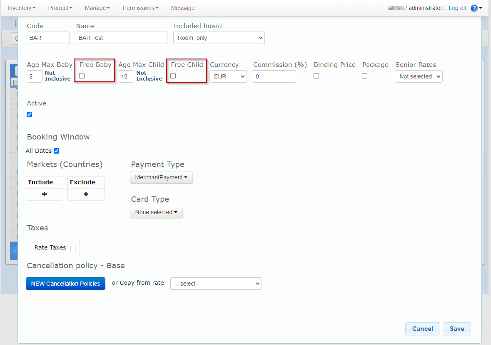
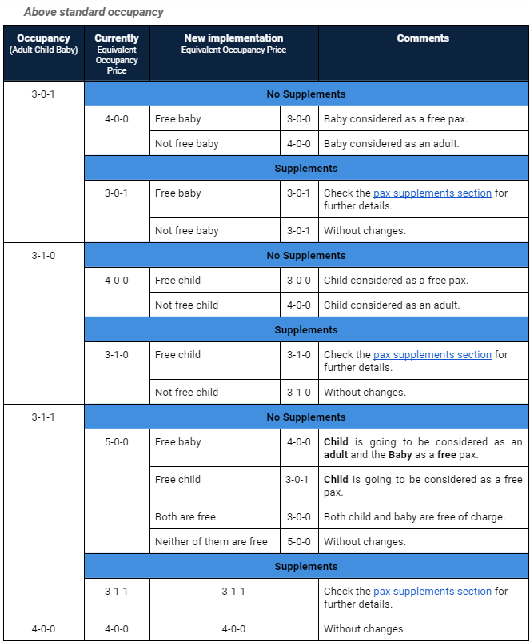
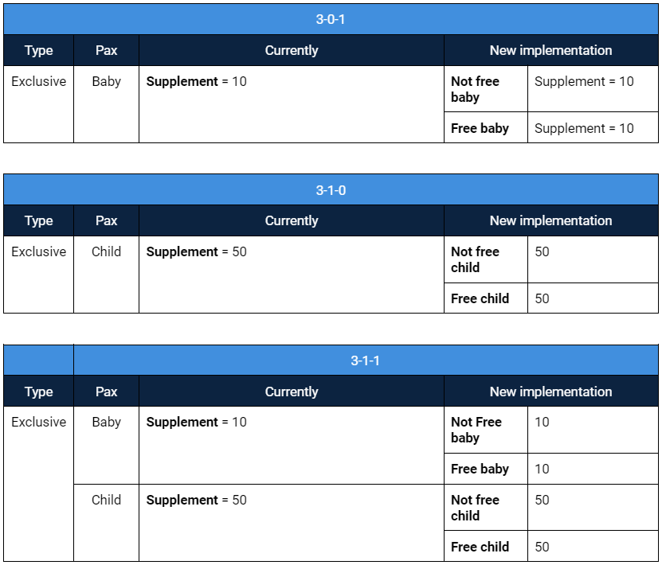
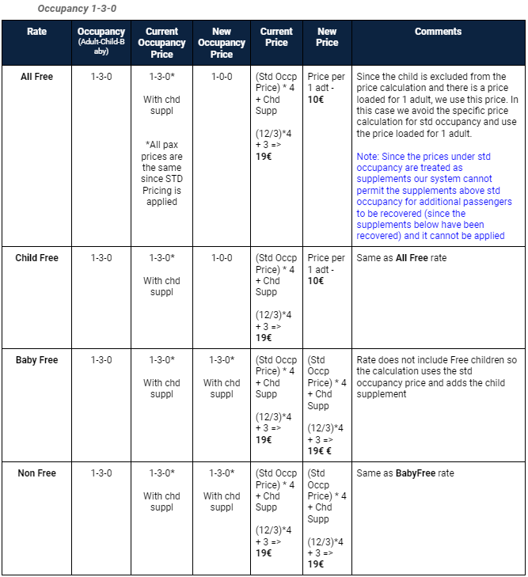

+++
title = "Free children and Free baby option "
pagetitle = "How to load free charges for child/baby pax?"
description = "Know how the free children and baby option works"
icon = "fa-file"
weight = 1
alwaysopen = false
isDirectory=false
+++

Currently, there are some Channel Managers that are not able to load their prices indicating free charges for child and baby occupancies. To avoid this problem, we have developed a new functionality that allows buyers to indicate that specific rates work with free child/baby.

When creating/editing a rate you will be allowed to set passenger conditions in contract terms. 

In order to avoid any disruption with the existing product, both check-boxes are going to be **unchecked by default**. It means that, by default, the system behaviour will remain the same as now.

 

## Price Calculation

As you may know, Inventory-X works with three different types of price, and each Channel Manager loads their product using one of them.

### Room Price

The Room Price is **not going to be affected** by this new feature.

All the room occupancies have the same price unless there are pax supplements loaded.

### Occupancy Price

The Occupancy Price is **not going to be affected** by this new feature.

This price already allows to update the final price for each occupancy with no additional calculations from the InventoryX system.

### Standard Occupancy Price

On the contrary, this type of price **is going to be affected**. The child and baby passengers are going to be considered as a free pax depending on the Free of Charge set value.

*Please, see the below study case for the new price calculation.*

#### Study case

The Standard Occupancy value is  3.

 

## Pax supplements

When a free of charge checkbox is checked, the pax supplement is always going to be considered as an Exclusive type regardless of if the supplement is *Amount* or *Percent* type.

 
Example:

* The Standard Occupancy value is  3
* 3-0-0 = 300€
* Child supplement = 50€
* Baby supplement = 10€

 

## Channel Manager Updates

When the Channel Manager updates product for a particular rate that has Free of Charge configured, the *Free of Charge* value set will always prevail over the update. It means that our system always will consider the specific pax as a free pax regardless of the Channel Manager update. 

## Detail Price Calculation Study Case

Using the following room occupations:

 

And the same occupancy price for all the rates:

 

The following price calculation logic will be applied for these example occupations: 

 

 

{}