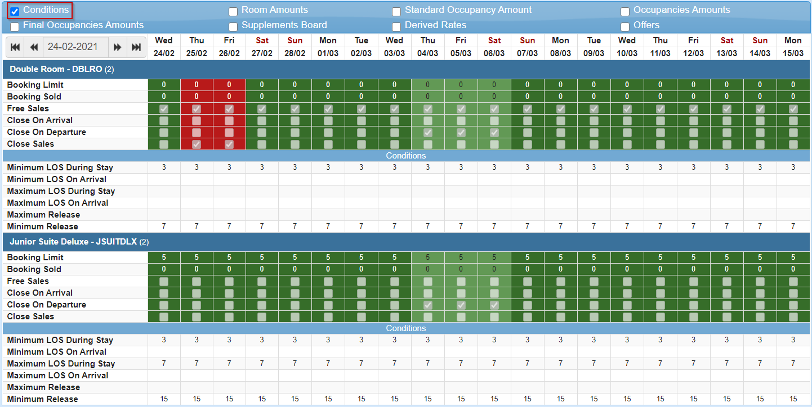
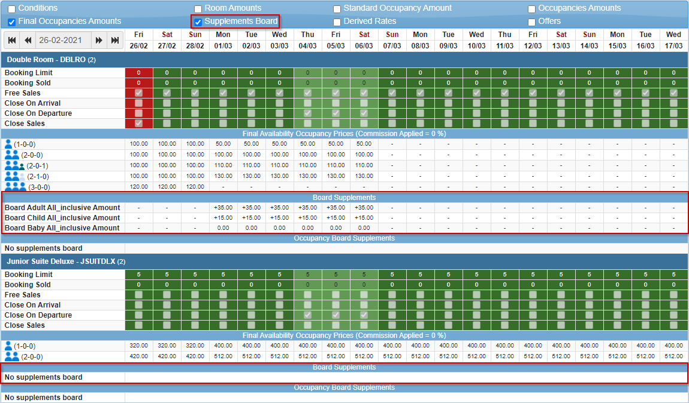

+++
title = "Calendar"
pagetitle = "Calendar"
description = "Check your loaded availability conditions and prices with the calendar"
icon = "fa-calendar"
weight = 3
alwaysopen = false
isDirectory=false
+++

The Calendar tool will allow you to check the information loaded in a hotel: conditions, amount per room, amount per passenger, amount per occupancy, final amount that will be shown in the availability search, meal plan supplements and derived rate amounts (with their conditions).

As in previous tools of the extranet, you will need to select the client and the provider. Then, you will be able to introduce the hotel and rate for which you want to check the information that has been loaded in the system. Once the rate is selected, a filter that allows you to filter per room or derived rate will appear. These two options, unlike the rate, are optional and if you do not indicate information in them, all product loaded for the rate will be displayed.

 

After selecting your filters you can click the `Search` button and the calendar will be displayed.

On top of the calendar you will see a checkbox row in which you can select the information that you want to be displayed. If there is nothing selected you will only see the general information of the rooms of the specific rate filtered. 

 

As you can see in our example above, we can see the rooms of the *BARTEST* rate: 

* Double Room (DBLRO)
* Junior Suite Deluxe (JSUITDLX)

* The numbers inside the brackets is the Standard Occupancy for that room. This value will help us to calculate the total amount of the room.*

For each room and day you will find availability information as the current booking limit, the booking sold and checkbox for free sales and stop sales conditions. In green it means that those days ara available to book, in red it means that there is a stop sale, and the light green that there is some kind of close sales, as close on departure or close on arrival. 

For example, the *Double Room* has the free sales activated for all those days, except 25/02 and 26/02 that have a close sales. Also, from 04/03 to 05/03 a close on departure is loaded. The *Junior Suite Deluxe* is not working with free sales, but has a booking limit of 5 for each day. 

**Use cases (checking only these conditions):**

* **Availability request from Tuesday 02/03 to Friday 05/03:** There will be no availability for any room because Friday 05/03 is not possible to do a check out (close on departure loaded).
* **Availability request from Friday 26/02 to Sunday 28/02:** There will be availability only for the *Junior Suite Deluxe* room. There will be no availability for the *Double Room* because Friday 26/02 there is a close sales.
* **Availability request from Saturday 06/03 to Friday 12/03:** There will be availability for both rooms.

In order to see more details we will check the additional options.

### Conditions

To be able to see the availability conditions loaded, you should check the `Conditions` option:

 

With this view you will be able to check the minimum and maximum stay length and release. For example, for all days, the *Double Room* has a condition of minimum 3 nights of stay length and a minimum release of 7 nights. However, the *Junior Suite Deluxe* has 15 of minimum release and a minimum of 3 nights and a maximum of 7 nights during the stay.

**Use cases (adding the LOS and release conditions):**

* **Availability request from Saturday 06/03 to Friday 12/03 with 5 days of release:** There will be no availability for any room because their minimum release condition.
* **Availability request from Friday 26/02 to Sunday 28/02 with 25 days of release:** There won't be availability for the *Junior Suite Deluxe* room because the minimum nights of stay is 3. There won't be availability for the *Double Room* because Friday 26/02 there is a close sales and the minimum nights of stay is 3.
* **Availability request from Saturday 06/03 to Friday 12/03 with 10 days of release:** There will be availability only for the *Double Room* because the release condition. 

### Price

Inventory-X system allows prices to be loaded in 3 different ways: price per room, price based on standard occupancy and price per occupancy. You will see three options in the checkbox row. Also, you have the `Final Occupancies Amounts` that allows you to check the final amount for each occupancy loaded after the calculations done by the system depending on the price type used to load. 

In this example, the *Double room* has price loaded per room from Friday 26/02 to Sunday 28/02 and, after that, the price used is price per occupancy. You can see the price loaded by type, but in the `Final Availability Occupancy Prices` row you will see the price that will be shown in the availability requests, including all calculations as extra passengers supplements. The currency is set up at rate level.

**Use cases (Double Room):**

* **From 26/02 to 28/02:** There is a price per room of 100€. All occupancies equal and below the standard occupancy (2) have the same price. Occupancies above the standard occupancy have price if a supplement was loaded. In this case child and baby have a supplement of 0€ (total price remains 100€) and a third adult a supplement of 20€ (total price for three adults is 120€). 
* **From 01/03 to 06/03:** There is price per occupancy loaded. In this case, the price loaded is the one loaded for each occupancy. In the example you can see price loaded for 1 adult, 2 adults, 2 adults and a baby and 2 adults and a child. Price for 3 adults has not been loaded, so there won't be availability response for those dates in this room for 3 adults.  
* **From 07/03 to 17/03**: There is not price loaded, so there won't be availability for this room on those dates. 

### Board/MealPlan supplements

In case that you want to see the board supplements information you should select the option ``Supplements Board``.

 

In this example, the *Double room* has board supplements loaded from Monday 01/03 to Saturday 06/03. The base meal plan or board for this rate was *Bed & Breakfast*, but availability with *All Inclusive* will be show for those dates with a supplement added to the final price. In this case, for each adult and each day in the stay, the price will be incremented 35€. For each child and day, the price will be incremented 15€, and for each baby the price won't be incremented because it was loaded as 0€. The *Junior Suite Deluxe* doesn't have any board supplement, so only *Bed & Breakfast* options will be shown for this room. 

### Derived Rates

In case that you want to see the Derived Rates information you should select the option ``Derived Rates``.

 

In this example, the *Double room* has a Derived Rate *Early Bird Discount 10%*. As you can see, below the final occupancy prices for that room, you will see the final occupancy prices for the derived rate. In the row below, you can see the discount applied, that in this example is a 10% with the condition of a minimum release of 60 days. 

So, in this example, if an availability request is made with a release of 60 days or more, for a stay date range from 26/02 to 28/02 and 2 adults, two options will be shown: 

1. Base Rate with Double Room and price 100€.
2. Derived Rate with Double Room and price 90€.

### Offers

In case that you want to see the Offers information you should select the option ``Offers``.

 

With this information you will be able to check if the offer is active or not and if there is some kind of availability conditions as close sales. 

{}