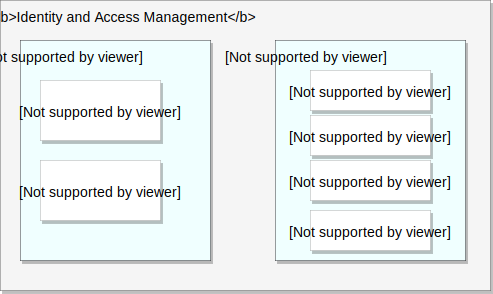
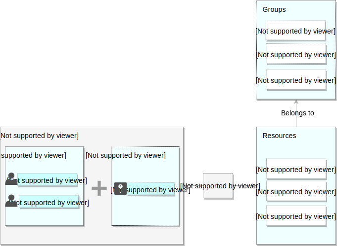

+++
title = "Identity and access management"
pagetitle = "Identity and security model"
description = "Advanced security management"
weight = 2
alwaysopen = false
+++

This section provides an overview of Identity and access management.

TravelgateX identity and acccess management lets administrators authorize who can take action on specific resources, giving you full control and internal visibility to manage resources centrally.

Identity and access management provides an unified view of your security policy across your entire organization, with built-in auditing to ease compliance processes.

As an administrator, when you register with us, we provide you with login details to access your TravelgateX account, including a username and password. As administrator, you can then add additional users to your account and grant them specific access.

Identity and access management lets you manage access control by defining who _Member_ has what kind of access _Role_ to each resource:

## Concepts related to identity
You grant access to **members** which can be either:

- **Users**: A developer, administrator or any other person from your `Organisation` who interacts with the TravelgateX Platform. An email address can be used as the identity of a `User`.

- **Service Accounts**: An application (`Client`) instead of an individual `User`. If you prefer, you can create as many `Service Accounts` as needed to represent different logical components of your application.

## Concepts related to access management
When an authenticated member attempts to make a request, the IAM policy will decide if the member is allowed to perform the operation requested.

### Resources and Groups
You can grant access to member for each resource or set of resources. Some examples of common resources are [Suppliers](/admin/concepts/common-resources/), [Accesses](/admin/concepts/common-resources/) and [Clients](/admin/concepts/common-resources/).

Groups are organized hierarchically, where the `Organization` node is the root node in the hierarachy, the **folders** are the children of the organization and the **products** are the children of the folders.

### Hierarchy assignment

Resources are assigned to groups and propagated by groups hierarchically from bottom to top.

### Permissions and Roles

Permissions determine what operations are allowed on a resource.

A role is a collection of permissions. You cannot assign a permission to the member directly; instead you grant them a role. When you grant a role to a user, you grant them all the permissions that the role contains.

Common roles include:
- **Viewer**: Allows a `User` to make `Queries` of resources, but not change any data
- **Editor**: Allows a `User` to make `Mutations` (changes) to the data
- **Special**: In your admin account, you can create special roles that might allow some of your users to only access specific resources. For example, if you have a large team and have divided them based on suppliers, you may choose to only grant each `User` access to the resources for a specific `Supplier`.

You can grant roles to members, which define who has what type of access. A policy is attached to a resource and identifies which member role is applied to every resource.

{}For more information about Identity and access management configuration, check out our tutorial [**How-to configure HotelX permissions**](/travelgatex/tutorials/howto-configure-permissions/)>{}
